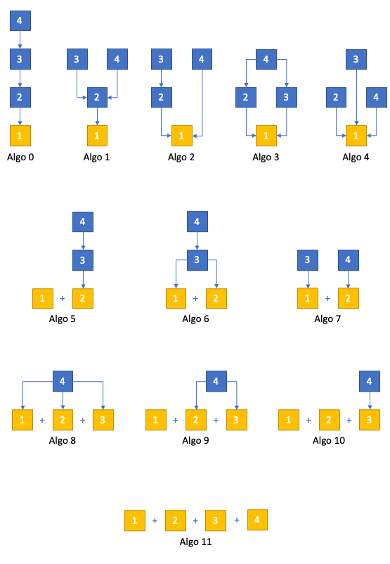

# aiotone

Audio synthesis and MIDI processing tools in AsyncIO.

## Installation

```
$ git clone https://github.com/ambv/aiotone
$ python3.8 -m venv /tmp/aiotone
$ source /tmp/aiotone/bin/activate
(aiotone)$ pip install Cython cymem
(aiotone)$ pip install -e .[dev]
(aiotone)$ python build.py
```

DISCLAIMER: tested on macOS only.

## Usage

### Realtime FM synthesis in pure Python

- this is work-in-progress polyphonic 4-operator FM synthesizer following
  the general Yamaha design;
- this is pushing Python real hard, your CPU might not be able to
  do realtime audio with this, if that's the case: decrease polyphony;
- as usual, MIDI IN and AUDIO OUT configuration is done through a config file;
- tested under macOS and Linux (both PulseAudio and ALSA) where we were
  able to achieve 8+ voices of polyphony without buffer underruns;
- use something like
  [BlackHole](https://github.com/ExistentialAudio/BlackHole/) to route
  audio to your DAW of choice.

For more information see:

```
(aiotone)$ python -m aiotone.fmsynth --help
```

Available algorithms:



### Performing on two Moog Mother 32 synthesizers as one instrument

- regular unison mode for rich chorus;
- power chord mode;
- duophonic mode: real 2-voice polyphony;
- legato-controlled glide (or sustain pedal-controlled glide);
- velocity-controlled accent notes;
- one Mother receives mod wheel on ASSIGN CV;
- the other Mother receives expression pedal on ASSIGN CV.

For more information:

```
(aiotone)$ python -m aiotone.redblue --help
```

### Sequencing the Novation Circuit + Novation Circuit Mono Station

```
(aiotone)$ python -m aiotone.circuits --help
```

See this talk for a full tutorial: https://www.youtube.com/watch?v=02CLD-42VdI

### Self-generating sequences for two Moog Mother 32 synthesizers and one Moog Subharmonicon

- the idea is to have a generative sequence that can still be modulated
  with incoming MIDI signal from the musician;
- so far very simple but will be extended;
- the musician controls pitch bend, expression, and damper pedal
  (I personally have them patched to control resonance, cutoff, and glide
  of the synthesizers);
- the musician can transpose the generated sequences on the fly.

For more information see:

```
(aiotone)$ python -m aiotone.mothergen --help
```

## Help, how do I use this?

You will need to figure out the names of your MIDI ports
(and, in the case of the FM synth, the name of your audio port).

You can run `python -m aiotone.lsdev` to list all the audio
and MIDI ports detected on your system, so that you know what
to enter in your `.ini` configuration file.
